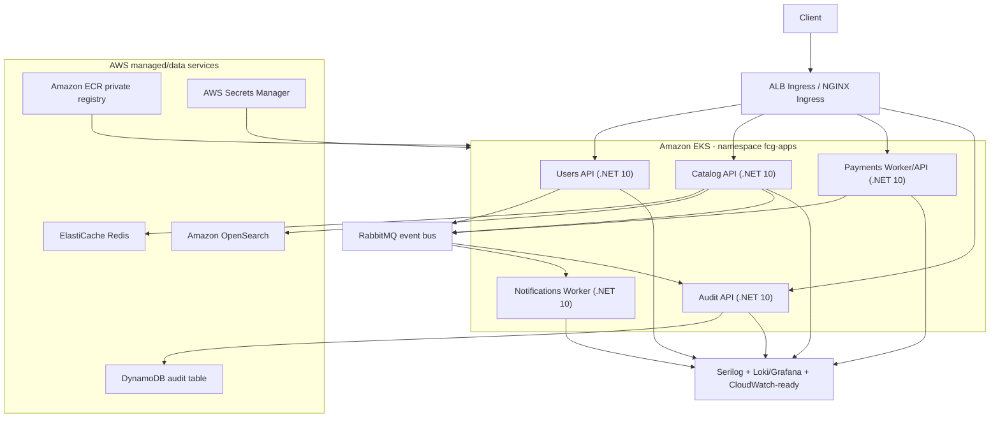

# FIAP Cloud Games - Fase 4 AWS

Este repositorio centraliza a infraestrutura e a orquestracao da Fase 4 do FIAP Cloud Games: Kubernetes gerenciado, CI/CD, Redis, OpenSearch, NoSQL, registry privado, Ingress, secrets externos, rolling update e observabilidade.

## Arquitetura alvo



## Repositorios Fase 4

- [Users](https://github.com/louresb/cloud-games-fase-4-users)
- [Catalog](https://github.com/louresb/cloud-games-fase-4-catalog)
- [Payments](https://github.com/louresb/cloud-games-fase-4-payments)
- [Notifications](https://github.com/louresb/cloud-games-fase-4-notifications)
- [Audit](https://github.com/louresb/cloud-games-fase-4-audit)

## Servicos

| Servico | Status Fase 4 | Itens principais |
|---|---|---|
| Users | Implementado | JWT com `tenant_id`, TenantId em entidade/migration, health checks, Serilog, K8s/HPA/CI-CD |
| Catalog | Implementado | Redis cache-aside, OpenSearch fuzzy search/read model, TenantId em Game, K8s/HPA/CI-CD |
| Payments | Implementado | Gateway mock, eventos com headers `TenantId`/`CorrelationId`, K8s/HPA/CI-CD |
| Notifications | Implementado | Worker event-driven, filtro MassTransit para TenantId em logs, K8s/HPA/CI-CD |
| Audit | Implementado | Consome eventos, persiste em DynamoDB, endpoint de consulta por tenant/correlacao, K8s/HPA/CI-CD |
| Orchestration | Implementado | Terraform EKS/ECR/Redis/OpenSearch/DynamoDB/Secrets, Ingress, infra local e scripts |

## Multi-tenant ready

Tenants oficiais: `FIAP`, `Alura`, `PM3`.

Preparacao entregue:

- `TenantId` no cadastro/login e em entidades principais (`User`, `Game`).
- Claim JWT `tenant_id` e headers HTTP `X-Tenant-Id`.
- Header MassTransit `TenantId` propagado nos eventos.
- Audit particionado por `TenantId` no DynamoDB.
- Logs estruturados com `TenantId` e `CorrelationId`.

## Infraestrutura AWS

Terraform em `terraform/` provisiona:

- EKS gerenciado com managed node group.
- ECR privado para os 5 servicos.
- ElastiCache Redis.
- OpenSearch Service.
- DynamoDB para audit trail.
- AWS Secrets Manager.
- IAM/IRSA para acesso sem credenciais em pod.
- Recurso ECS opcional para Notifications, desativado por padrao.

Valores sensiveis nao ficam hardcoded. Use `terraform.tfvars` local ou secret manager/CI secrets.

## Kubernetes

Manifests principais:

- `k8s/namespaces.yaml`
- `k8s/fcg-ingress.yaml`
- `k8s/redis-deployment.yaml` e `k8s/opensearch-deployment.yaml` para demo local/kind
- `k8s/dynamodb-local-deployment.yaml` para demo local/kind
- `k8s/external-secrets-operator.yaml` para EKS com AWS Secrets Manager
- `k8s/*` em cada servico com Deployment, Service, ConfigMap e HPA

Todos os Deployments dos servicos usam RollingUpdate com `maxUnavailable: 0` e requests/limits.

## CI/CD

Cada repositorio de servico contem:

- `.github/workflows/build-and-test.yml`
- `.github/workflows/deploy.yml`

Pipeline de deploy:

1. `dotnet restore/build/test`
2. `docker build`
3. autenticacao na AWS com credenciais configuradas no GitHub
4. push para Amazon ECR
5. `aws eks update-kubeconfig`
6. `kubectl apply`
7. `kubectl rollout status`

## Execucao local

Dependencias locais:

```powershell
cd cloud-games-fase-4-orchestration-aws
copy .env.example .env
# ajuste SQL_PASSWORD, JWT_SECRET, PAYMENT_WEBHOOK_API_KEY se necessario
docker compose -f docker-compose.fase4.yaml up -d
```

Validacao de codigo:

```powershell
.\scripts\validate-phase4.ps1
```

Deploy em cluster Kubernetes ja configurado:

```powershell
.\scripts\deploy-k8s-local.ps1
kubectl -n fcg-apps get pods,svc,hpa,ingress
```

